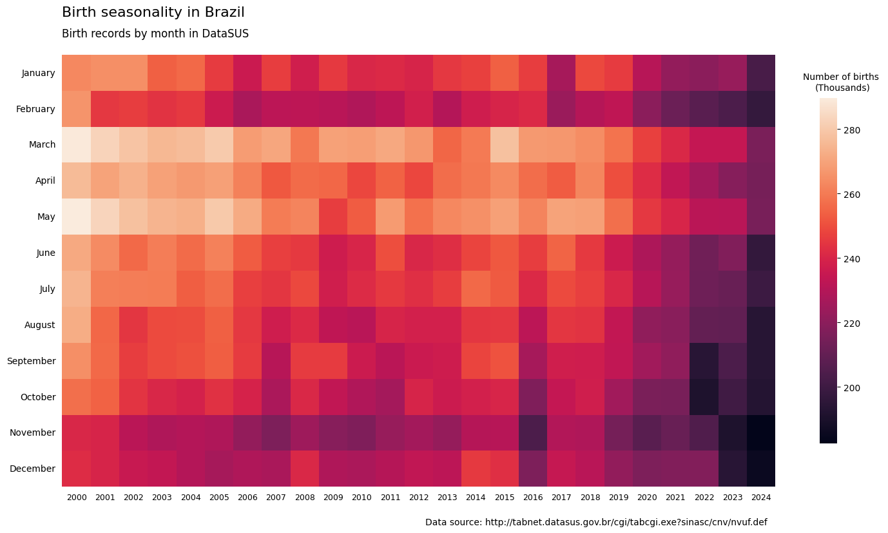

# Brazilian Births

This project visualizes birth records in Brazil as a heatmap using public data from DataSUS. The chart shows how births vary by month and year, which makes seasonal patterns easy to spot.

It was inspired by Saloni's [similar plot](https://www.scientificdiscovery.dev/p/20-so-many-great-things-you-missed) about the seasonality of births in the USA. (which was itself inspired by [another plot](https://kieranhealy.org/blog/archives/2018/04/10/visualizing-the-baby-boom/))

## Data Source

The data comes from the [DATASUS TABNET](https://datasus.saude.gov.br/informacoes-de-saude-tabnet/) system, specifically the SINASC dataset.

To build the spreadsheet used by the script, do this:

1. Go to the [DATASUS TABNET](https://datasus.saude.gov.br/informacoes-de-saude-tabnet/) page.
	- In the "Estatísticas Vitais" section, click on "Nascidos Vivos (SINASC)".
	- and select "Nascidos vivos - desde 1994"
2. On the next page, select these for national coverage:
	- Select "Nascidos vivos"
	- Snd in "Abrangência Geográfica", select "Brasil por Municípios"
3. On the next table setup screen, choose:
	- Linha (Row): "Mês do nascimento"
	- Coluna (Column): "Ano do nascimento"
	- Conteúdo (Content): "Nascim p/resid.mãe"
	- Select the desired years in the period field. The current dataset in this repo covers 1997 to 2024.
	- Click "Mostrar" to show results. (It may take some time if there is a lot of data to aggregate)
4. The next page will show the results in a formatted table. Carefully copy and paste the data into the `births_brazil_datasus.xlsx` table.

## How It Works

The script in [heatmap.py](heatmap.py) reads `births_brazil_datasus.xlsx`, converts the table into a pandas DataFrame, and renders a heatmap with Seaborn and Matplotlib. The final image is saved as `brazil_births_heatmap.png`.

## Requirements

You need Python with these packages installed:

- pandas
- matplotlib
- seaborn
- openpyxl

## Run It

Place `births_brazil_datasus.xlsx` in the same folder as [heatmap.py](heatmap.py), then run:

```bash
python heatmap.py
```

The script will generate `brazil_births_heatmap.png` in the project directory and open the figure window.

## Output



## Notes

- The script expects the Excel file to retain the same layout as it was exported from DATASUS.
- If you update the input data, rerun the script to regenerate the chart.
